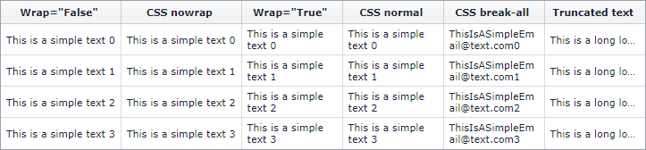

<!-- default badges list -->
[](https://supportcenter.devexpress.com/ticket/details/T175881)
[](https://docs.devexpress.com/GeneralInformation/403183)
<!-- default badges end -->

# Grid Control for ASP.NET Web Forms - Different options for wrapping text
<!-- run online -->
**[[Run Online]](https://codecentral.devexpress.com/t175881/)**
<!-- run online end -->

The suggested techniques are common and may be used not only for [ASPxGridView](https://docs.devexpress.com/AspNet/DevExpress.Web.ASPxGridView), but for other controls also.



## Disable text wrapping to show text in one line

You can disable text wrapping in the following ways:

* Set a column's [CellStyle.Wrap](https://docs.devexpress.com/AspNet/DevExpress.Web.AppearanceStyleBase.Wrap) property to `false`.

    ```ASPx
    <dx:GridViewDataColumn FieldName="C1" Width="100" Caption='Wrap="False"'>
        <CellStyle Wrap="False" />
    </dx:GridViewDataColumn>
    ```

* Set the CSS `white-space` property to `nowrap`.

    ```CSS
    .disableWrapping {  
        white-space: nowrap;  
    }
    ```
      
    ```ASPx
    <dx:GridViewDataColumn FieldName="C2" Width="100" Caption='CSS nowrap'>
        <CellStyle CssClass="disableWrapping" />
    </dx:GridViewDataColumn>
    ```

Note that when text wrapping is disabled, the column's `Width` property in not in effect.

## Enable wrapping to set column width

You can enable text wrapping in the following ways:

* Set the column's [CellStyle.Wrap](https://docs.devexpress.com/AspNet/DevExpress.Web.AppearanceStyleBase.Wrap) property to `true`.

    ```ASPx
    <dx:GridViewDataColumn FieldName="C3" Width="100" Caption='Wrap="True"'>
        <CellStyle Wrap="True" />
    </dx:GridViewDataColumn>
    ``` 

* Set the CSS `white-space` property to `normal`.

    ```CSS
    .enableWrapping {  
        white-space: normal;  
    }
    ```
    
    ```ASPx
    <dx:GridViewDataColumn FieldName="C4" Width="100" Caption='CSS normal'>
        <CellStyle CssClass="enableWrapping" />
    </dx:GridViewDataColumn>
    ```

## Wrap text without white spaces

The previous approach works if cell text contains white spaces only. To wrap text that does not contain white spaces, use the CSS `word-break` property.

```CSS
.wrapEmail {  
    word-break: break-all;  
}
``` 
```ASPx
<dx:GridViewDataColumn FieldName="C5" Width="100" Caption='CSS break-all'>
    <CellStyle CssClass="wrapEmail" />
</dx:GridViewDataColumn>
```

## Show a truncated text

Set the [GridDataColumnSettings.AllowEllipsisInText](https://docs.devexpress.com/AspNet/DevExpress.Web.GridDataColumnSettings.AllowEllipsisInText) property to `true` to automatically truncate cell text if it does not fit into the cell's width. To indicate clipped text, the control displays an ellipsis (`…`).

```aspx
<dx:GridViewDataColumn FieldName="C6" Width="100" Caption='Truncated text'>
    <Settings AllowEllipsisInText="true" />
</dx:GridViewDataColumn>
```

## Files to Review

* [Default.aspx](./CS/Default.aspx) (VB: [Default.aspx](./VB/Default.aspx))
* [Default.aspx.cs](./CS/Default.aspx.cs) (VB: [Default.aspx.vb](./VB/Default.aspx.vb))
